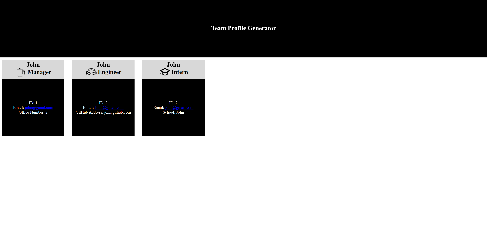

# Team Profile Generator

## Introduction

Programmatically generate profiles for all of your employees! This project was built so that users can quickly and easily produce a high-quality, single-page web application that displays a team profile in a siple format. It also served as an excellent introduction to Node.js and several of its packages (including inquirer and fs) and really forced me to consider concepts like code modularization more closely.

## Table of Contents

[Introduction](#introduction)  
[Dependencies](#dependencies)  
[Installation](#Installation)
[Usage](#usage)  
[Contributing](#contributing)

## Prerequisites

This application requires Node.js to function. Download the installer here: https://nodejs.org/en/download/. Following installation, run "npm i" from a command prompt to install the required dependencies.

## Usage

Team Profile Generator accepts user input using the Node.js Inquirer package and injects the code

For a demonstration of the applpication's functionality, see the video in the link below;

https://watch.screencastify.com/v/36X9NwB4fwpAlqOg98jD

## Contributing

Feel free to fork/leave suggestions in the slack channel.

## Questions

Feel free to shoot me any questions at the email below:

rrich.kray@gmail.com

find my GitHub profile by following the link below:

https://github.com/rrich-kray/
